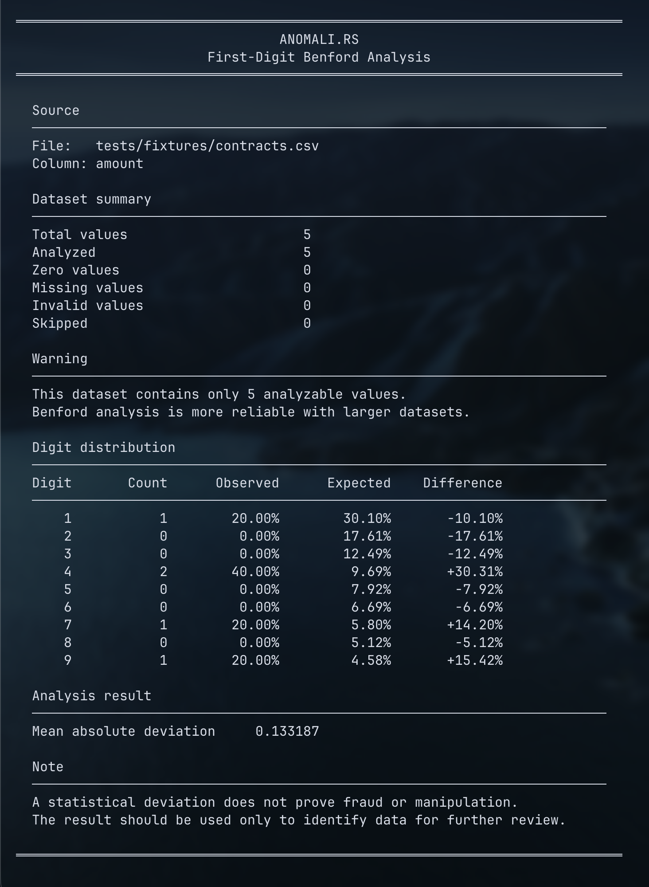

# Anomali.rs


[](https://opensource.org/licenses/Apache-2.0)
[](https://github.com/dwego/anomali-rs/actions/workflows/ci.yml)

Anomali.rs is an open-source command-line tool written in Rust for detecting unusual numerical patterns in datasets.

The current version reads a CSV file, selects a numerical column, extracts the first significant digit from each valid value, and compares the observed distribution with the distribution predicted by Benford's Law.

The goal of the project is not to determine whether fraud has occurred. Instead, Anomali.rs helps identify datasets whose numerical behavior differs significantly from what would normally be expected, allowing those records to be investigated more closely.

## How it works

The user provides a CSV file and selects the numerical column that should be analyzed.

```bash
cargo run -- scan contracts.csv --column amount
```

For every value in the selected column, Anomali.rs extracts the first non-zero digit.

For example:

$$
1250.50  → 1
0.0042   → 4
-750.00  → 7
$$

Zero values, missing values, and invalid values are counted separately and are not included in the Benford distribution.

After extracting the digits, Anomali.rs counts how often each digit from 1 to 9 appears and compares the observed frequencies with the frequencies predicted by Benford's Law.

## The mathematics behind Benford's Law

Benford's Law states that the first significant digits in many naturally occurring datasets are not uniformly distributed. Smaller digits usually appear more frequently than larger digits.

For a first digit $d$, where $d$ is an integer from $1$ to $9$, the expected probability is:

$$
P(d) = \log_{10}\left(1 + \frac{1}{d}\right)
$$

For example, the expected probability for the digit $1$ is:

$$
\begin{aligned}
P(1)
&= \log_{10}\left(1 + \frac{1}{1}\right) \
&= \log_{10}(2) \
&\approx 0.30103
\end{aligned}
$$

Therefore, approximately $30.10%$ of the values in a suitable dataset are expected to begin with the digit $1$.

For the digit $9$:

$$
\begin{aligned}
P(9)
&= \log_{10}\left(1 + \frac{1}{9}\right) \
&= \log_{10}\left(\frac{10}{9}\right) \
&\approx 0.04576
\end{aligned}
$$

Therefore, approximately $4.58%$ of the values are expected to begin with the digit $9$.

This produces the following expected distribution:

| Digit | Expected frequency |
| ----: | -----------------: |
|     1 |             30.10% |
|     2 |             17.61% |
|     3 |             12.49% |
|     4 |              9.69% |
|     5 |              7.92% |
|     6 |              6.69% |
|     7 |              5.80% |
|     8 |              5.12% |
|     9 |              4.58% |

## Observed frequency

Anomali.rs counts how many analyzed values begin with each digit.

The observed frequency for a digit $d$ is:

$$
O(d) = \frac{C(d)}{N}
$$

Here, $C(d)$ is the number of values beginning with $d$, while $N$ is the total number of analyzable values.

For example, suppose $314$ out of $1{,}000$ values begin with the digit $1$:

$$
O(1) = \frac{314}{1000} = 0.314
$$

The observed frequency is therefore $31.4%$.

## Difference from Benford's Law

For each digit, Anomali.rs calculates the signed difference between its observed and expected frequencies:

$$
D(d) = O(d) - P(d)
$$

Using the previous example:

$$
\begin{aligned}
D(1)
&= 0.314 - 0.30103 \
&= 0.01297
\end{aligned}
$$

A positive result means the digit appeared more frequently than expected. A negative result means it appeared less frequently than expected.

## Mean Absolute Deviation

To summarize the overall difference between the dataset and Benford's distribution, Anomali.rs calculates the Mean Absolute Deviation, or $MAD$:

$$
MAD =
\frac{1}{9}
\sum_{d=1}^{9}
\left|O(d)-P(d)\right|
$$

The absolute value prevents positive and negative differences from cancelling each other.

A smaller $MAD$ means the observed distribution is closer to Benford's Law. A larger $MAD$ means the dataset presents a stronger statistical deviation.

The $MAD$ measures deviation only. It does not prove fraud, manipulation, or illegal activity.

## Example

```bash
cargo run -- scan tests/fixtures/contracts.csv --column amount
```



## When Benford's Law is useful

Benford analysis works best with naturally generated numerical data that spans multiple orders of magnitude.

Examples may include financial transactions, public expenses, invoice values, company revenues, population data, measurements, and accounting records.

It should not be applied blindly. Datasets containing identifiers, telephone numbers, postal codes, fixed prices, school grades, ages from a restricted population, or values limited to a narrow range are generally not suitable for Benford analysis.

## Development

Clone the repository and run:

```bash
cargo build
cargo test
```

Before opening a pull request, run the same checks used by the continuous integration workflow:

```bash
cargo fmt --all -- --check
cargo clippy --all-targets --all-features -- -D warnings
cargo test --all-targets --all-features
```

Every pull request is automatically checked using GitHub Actions.

## Project status

Anomali.rs is currently in its first development stage. The current version supports first-digit Benford analysis for a single column in a CSV file.

Future versions may support grouped analysis, additional Benford tests, JSON reports, configurable file formats, repeated-value detection, rounded-number analysis, threshold clustering, and other explainable anomaly detection methods.

The long-term goal is to turn Anomali.rs into a fast and extensible engine for investigating unusual patterns in financial and public datasets.

## Disclaimer

Anomali.rs is an analytical tool, not a fraud detection system.

A deviation from Benford's Law does not prove fraud, manipulation, or illegal activity. Results must always be interpreted together with the context, origin, size, and characteristics of the dataset.
